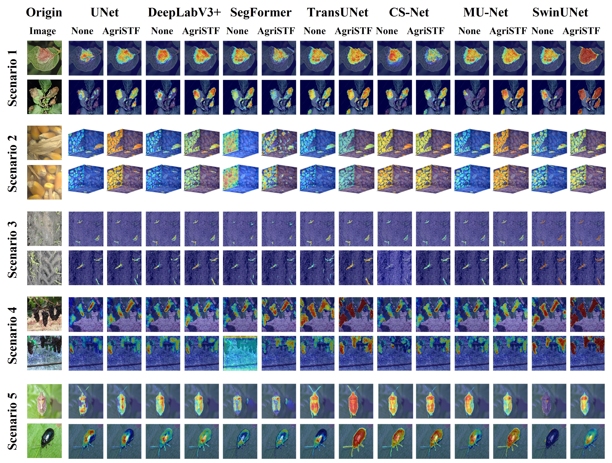

<div align="center">

<h1>AgriSTF: A Unified Training Framework for Agricultural Image Segmentation via Masked Image Modeling</h1> 

<div>
    <a>Guorun Li</a>;
    <a>Yucong Wang</a>;
    <a>Wang Liu</a>;
    <a>Liu Lei</a>;
    <a>Xiaoyu Li</a>;
    <a>Yuefeng Du*</a>;
</div>

<h3><strong>submitted to Knowledge-Based Systems in 2025</strong></h3>

</div>

## 🏠 TODOs
* [x] MPSR model.

**Notes**:
- At the core of AgriSTF is the proposed masked pixel-semantic reconstruction (MPSR) method in Stage 1.
- So, we only release MPSR's code.


## 🏠 Abstract
Accurate agricultural image segmentation (AIS) is crucial for ensuring food security, enhancing agricultural production efficiency, and improving resource utilization. However, constrained by the seasonal nature of agricultural production, incomplete sensor networks, and the specialized nature of annotation, segmentation models trained under data-scarce conditions face challenges of overfitting and poor generalization capabilities. To the enhance segmentation accuracy and generalization capabilities of existing models under existing labeled data, this study proposed a two-stage unified training framework for agricultural image segmentation model, named AgriSTF. The first stage employs the developed Masked Pixel-Semantic Reconstruction (MPSR) for self-supervised pretraining of the segmentation model’s encoder. The second stage utilizes labeled data for supervised fine-tuning of the segmentation model. MPSR defines the self-supervised proxy task as jointly predicting masked pixels and semantic tokens, establishing bidirectional constraints between local details and high-level semantics through a carefully designed Joint Decoder. Over 150 experiments conducted across five AIS tasks and seven representative baselines demonstrated that AgriSTF consistently improved baseline accuracy, achieving competitive results even in settings utilizing only 50% of training epochs or only 50% of labeled data. Additionally, comprehensive ablation experiments were conducted to investigate the optimal hyperparameter settings for MPSR. AgriSTF is model agnostic and data efficient, providing a new approach for training under limited-data conditions and showing the potential to become a foundational training paradigm for developing AIS models in the future. 

## 🏠 Overview




## 🎁 Pre-Training 
We have provided detailed instructions for model training details. 

### Install
- Clone this repo:

```bash
conda create -n agristf python=3.10 -y
conda activate agristf
git clone https://github.com/CAU-COE-VEICLab/AgriSTF.git
cd AgriSTF
```
- Install `CUDA>=10.2` with `cudnn>=7` following
  the [official installation instructions](https://docs.nvidia.com/cuda/cuda-installation-guide-linux/index.html)
- Install `PyTorch>=1.8.0` and `torchvision>=0.9.0` with `CUDA>=10.2`:

```bash
pip install torch==1.10.0+cu111 torchvision==0.11.0+cu111 torchaudio==0.10.0 -f https://download.pytorch.org/whl/torch_stable.html
pip install timm==0.4.12
pip install opencv-python==4.4.0.46 termcolor==1.1.0 yacs==0.1.8 pyyaml scipy
pip install -r requirements.txt
```

## Pre-Training 

To train the any model's encoder on your dataset, run:

```bash
python -m torch.distributed.launch --nproc_per_node <num-of-gpus-to-use> main_mpsr.py \ 
--cfg <config-file> --data-path <data-path> [--batch-size <batch-size-per-gpu> --output <output-directory> --tag <job-tag>]
```

To train the SwinUnet's encoder on your dataset, run:
For example, to pre-train SwinUnet's encoder, run:

```bash
python -m torch.distributed.launch --nproc_per_node 16 main_simmim.py \ 
--cfg configs/swinunet_mpsr_100epoch/mpsr_pretrain_swinunet_100ep_256 --batch-size 128 --data-path <data-path> [--output <output-directory> --tag <job-tag>]
```


## Acknowledge

Our implementations are partially inspired by [SimMIM](https://github.com/microsoft/SimMIM).

Thanks for their great works!


## Citation
